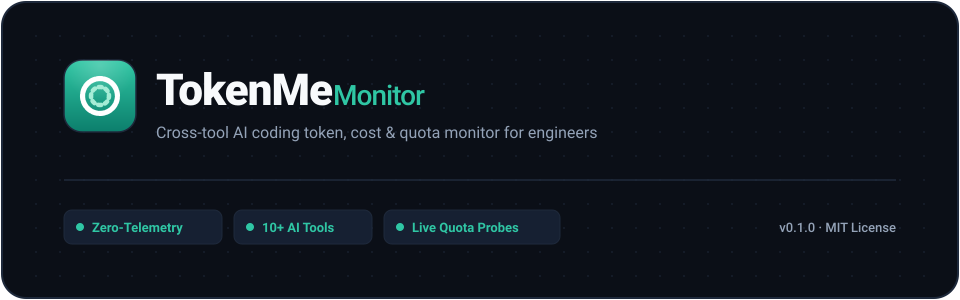
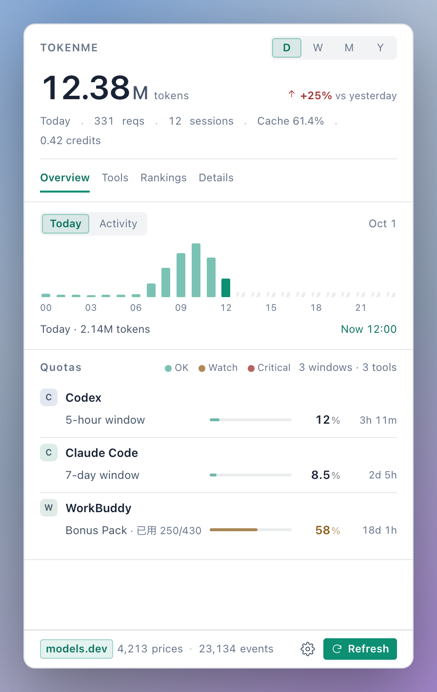
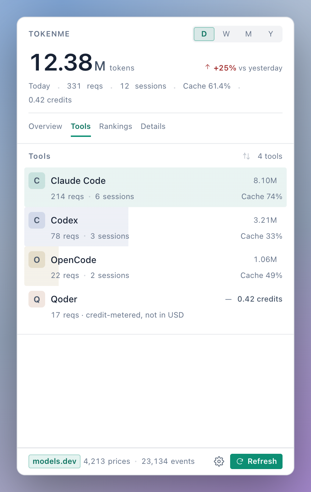
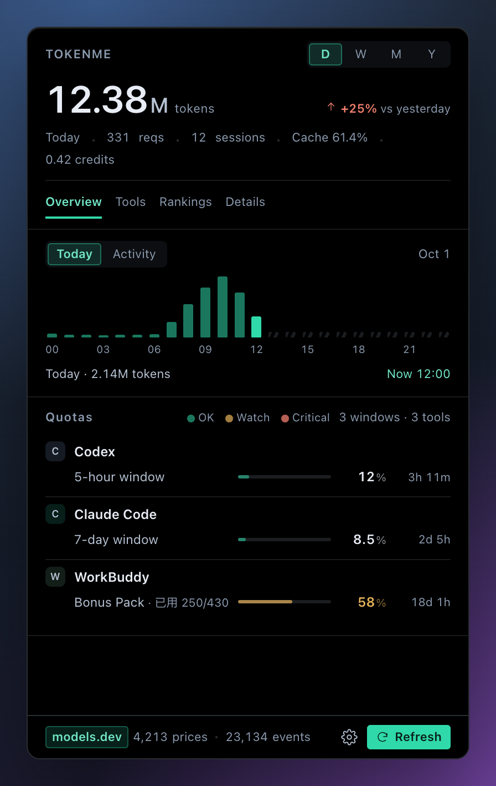
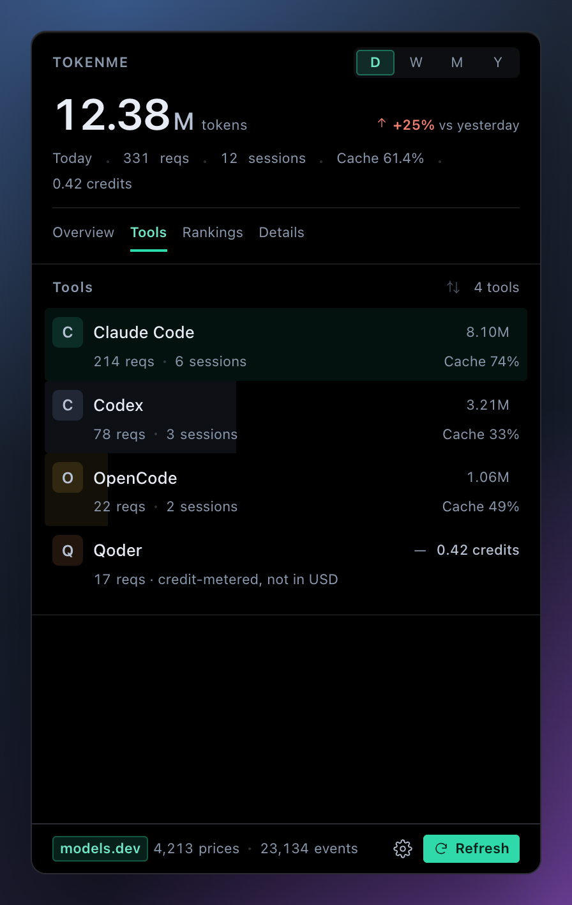
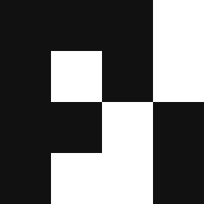
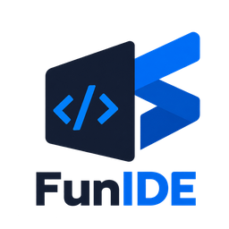
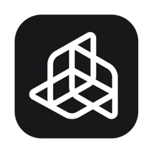
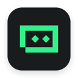
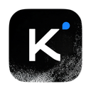

<p align="center">
  
</p>

<p align="center">
  <a href="https://github.com/Bencibr/tokenme"></a>
  <a href="https://www.rust-lang.org/"></a>
  
  
</p>

<p align="center">
  <b>One menu bar dashboard for every AI coding tool's token usage, spend, and remaining quota — so you stop checking each vendor's console.</b>
</p>

<p align="center">
  <b>English</b> | <a href="README_CN.md">简体中文</a>
</p>

## What is TokenMe?

TokenMe is a menu bar app that tracks token usage, spend, and subscription quota across the AI coding tools you already run. Native installers for macOS and Windows, a fully static Linux collector and CLI. It answers three questions that usually have no good home:

- How many tokens did I burn today, and what did they cost?
- How much is left on each subscription, and when does it reset?
- Which tool owns this month's spend — and how much did caching actually save me?

Those numbers normally live in each vendor's own console and local logs, and none of them speak the same language. TokenMe reads the logs and databases your tools already write to disk and folds them into one local index.

## Sound familiar?

Working across Claude Code, Codex, ZCode and the rest, this tends to happen:

- You want to know what today cost, so you open three vendor consoles — and their numbers don't agree.
- A 5-hour rolling window runs dry right when the work is hottest.
- Points, credits, dollar windows — every subscription ships its own dashboard, and none of them talk to each other.
- At month's end you want the per-tool breakdown, and the only way to get it is parsing logs by hand.

TokenMe puts all of it in one panel, a click away.

## Screenshots

<p align="center">
  
  
  
  
</p>

## Inside the panel

The panel opens with four pages, each one drilling deeper:

- **Overview** — today's tokens, spend, and cache hit rate; an hour-by-hour usage chart; each vendor's quota bar with remaining share and reset countdown; and a native banner when a window crosses 80% used or runs out — thresholds, and which vendors are asked at all, are settings.
- **Tools** — one row per tool: requests, sessions, tokens, cache rate — with each tool's share painted into the row itself.
- **Rankings** — sessions ranked, so the expensive ones surface immediately.
- **Details** — per-request records, filterable by model and project.

The UI follows the system language: English and Chinese. Costs are converted, not billed — token counts times the [models.dev](https://models.dev) price list. It won't match a vendor invoice to the cent, but it answers where the money went and whether it was well spent. The index handles hundreds of thousands of events, builds in seconds, and each incremental scan after that takes tens of milliseconds.

## The CLI

When the panel stays closed, the CLI reads the same index:

```text
$ tokenme daily --days 3

┌────────────┬──────────┬──────────┬────────┬────────────┬────────┬────────┬─────────┬────────┐
│ Day        │ sessions │ requests │  input │ cache read │ output │  total │    cost │ cached │
├────────────┼──────────┼──────────┼────────┼────────────┼────────┼────────┼─────────┼────────┤
│ 2026-09-25 │      216 │   12,900 │  56.2M │      1.68B │   4.5M │  1.74B │  $99.15 │  96.8% │
│ 2026-09-26 │       45 │    4,592 │  30.5M │      704.9M │   1.8M │ 737.1M │  $54.53 │  95.9% │
│ 2026-09-27 │        6 │    2,534 │  25.1M │      377.1M │   1.1M │ 403.4M │  $46.49 │  93.8% │
├────────────┼──────────┼──────────┼────────┼────────────┼────────┼────────┼─────────┼────────┤
│ total      │      256 │   20,026 │ 111.8M │      2.76B │   7.4M │  2.88B │ $200.18 │  96.1% │
└────────────┴──────────┴──────────┴────────┴────────────┴────────┴────────┴─────────┴────────┘
```

## Install

**Homebrew (macOS)** — tap once, then short names:

```bash
brew tap Bencibr/tokenme https://github.com/Bencibr/homebrew-tokenme
brew trust bencibr/tokenme        # once — brew 6 asks before trusting third-party casks
brew install --cask tokenme       # the menu-bar panel
brew install tokenme-cli          # the CLI
```

The tap is bumped automatically on every release, so `brew upgrade` keeps you current, and cask installs carry no quarantine flag — Gatekeeper never steps in.

**Installers**: grab one from [Releases](https://github.com/Bencibr/tokenme/releases/latest) — the macOS menu-bar app (drag to Applications), a Windows setup, and the static Linux collector tarballs (`x86_64` / `aarch64`, each with `install-linux.sh` beside it).

**Windows installation**: the setup supports an all-users install for shared machines. Choose **All users** in the installer when TokenMe should be available to every Windows account; use the same mode for upgrades so the machine-wide installation is replaced in place.

> **First launch on macOS** (manual DMG only): the bundle is ad-hoc signed (no developer certificate), so Gatekeeper may step in. Right-click → Open works, or clear the quarantine flag:
>
> ```bash
> sudo xattr -rd com.apple.quarantine /Applications/TokenMe.app
> ```

Build from source instead:

```bash
git clone https://github.com/Bencibr/tokenme.git
cd tokenme
cargo install --path crates/usage-cli --bin tokenme   # CLI
./scripts/build-macos.sh                              # macOS panel
```

Once it's in, run a detection pass and look at the last week:

```bash
tokenme detect          # find every installed tool and where its logs live
tokenme daily --days 7  # the last week's daily usage and spend
tokenme quota           # live quotas and reset countdowns
```

## Linux — the headless collector

The menu-bar panel is macOS and Windows. **Linux is where the work actually happens** — the box you SSH into, the container your agent runs in, the build machine that never shows a GUI — so Linux ships as a first-class collector rather than an afterthought: one fully static binary (musl, `x86_64` and `aarch64`, so there is no glibc version to match and no Rust or Python to install on the machine), plus one command to make it report home.

```bash
tar xzf tokenme-cli-*-linux-musl.tar.gz
cd tokenme-cli-*-linux-musl
./install-linux.sh --every 15 --push you@display-host
```

That puts `tokenme` in `~/.local/bin` (appending the PATH line to `~/.profile` when it is missing) and installs a **systemd `--user` timer** that runs `tokenme export --days 30` every 15 minutes into `~/tokenme-sync`, then scp's each fresh bundle to the display machine — whose panel merges it on its next pass and shows it as that machine's numbers, under its own name. No user manager reachable (a container, a bare ssh session)? The installer falls back to a **cron job running the same generated script**, and `--uninstall` cleans up either one while keeping your data. On a headless box the installer also turns on lingering (or prints the one `loginctl enable-linger $USER` line to run) so the timer keeps firing with nobody logged in. `--days 400` once pulls the whole retention window in as a backfill; `--prefix <dir>` moves the binary.

Run it interactively and the same numbers are available in a terminal, with no display at all:

```bash
tokenme detect          # what is installed here, and where each tool's logs live
tokenme daily --days 7  # a week of usage and spend
tokenme quota           # live quotas and reset countdowns
tokenme export          # one bundle into ~/tokenme-sync
```

Or skip the timer and move `~/tokenme-sync` yourself — Syncthing, a shared mount, a nightly rsync. The transport is yours: tokenme opens no port, runs no daemon beyond that timer, and holds no accounts. The panel can also do the SSH half for you — its footer 服务器 entry probes a host, pins its fingerprint, installs the collector and pulls bundles on a schedule. See the [user guide](docs/USER_GUIDE.md) §4.

## Common commands

| Command | What it does |
| :--- | :--- |
| `tokenme daily --days 30` | Day-by-day throughput, cache rate, and cost |
| `tokenme report --window week --group model` | One window, broken down every which way |
| `tokenme quota` | Live quotas with reset countdowns |
| `tokenme budget set zcode --monthly 50` | Put a monthly cap on a tool that has none |
| `tokenme export` / `tokenme import` | Ship a window of the index to another machine and merge it back — file-based, idempotent, no accounts |
| `tokenme pricing explain <model>` | Audit where a price comes from |

## Supported tools & live quota

The quota bars come from each tool's own API or local credentials — probes that read, and never log you in. Three probes are deliberate exceptions, because those tools keep a short-lived access token on disk and the bar goes dead without a renewal: MiniMax Code (~1 h), Kimi Code (the vendor's own 15-minute token) and Cline's gateway token. Each exchanges the refresh token sitting in that same file and writes the rotated pair straight back, in that tool's own format and atomically — a rotation that is not persisted is a rotation consumed, and the app's own next refresh would then find its login dead. A failed exchange changes nothing. Every other probe reads credentials and never writes them. When a host app quits, its probes pause and the last numbers stay on screen; relaunch the app and they resume. The "pause quota on exit" setting controls this.

Every tool below ships as a built-in adapter — 23 of them, indexed straight from the logs and databases each one writes to disk:

| Tool | Live quota | Fixtures | Verified on |
| :--- | :--- | :--- | :--- |
|  **Claude Code** | 5-hour / cycle windows — official backend | ✅ | macOS ✅ · Windows ⏳ |
|  **Codex** | ChatGPT rate windows — official backend | ✅ | macOS ✅ · Windows ✅ |
|  **OpenCode** | Go subscription, three dollar windows | ✅ | macOS ✅ · Windows ⏳ |
|  **Pi** | — | ✅ | macOS ✅ · Windows ⏳ |
|  **Cline** | Account window limits — Cline account API | ✅ | macOS ✅ · Windows ✅ |
|  **ZCode** | 5-hour/cycle windows + session budgets — the IDE's own quota API + local cookie decryption | ✅ | macOS ✅ · Windows ✅ |
|  **Qoder** | Subscription windows — vendor usage API, local encrypted snapshot fallback; daily check-in state | ✅ | macOS ✅ · Windows ⏳ |
|  **Antigravity** | Self-computed — runs the CLI's `/usage` | ✅ | macOS ✅ · Windows ⏳ |
|  **AgnesCode** | Membership points — needs a one-time token (see below) | ✅ | macOS ✅ · Windows ✅ |
|  **AtomCode** | CodingPlan quota — local daemon | ✅ | macOS ✅ · Windows ⏳ |
|  **WorkBuddy** | Member credits — the desktop app's billing API / local broker | ✅ | macOS ✅ · Windows ✅ |
|  **Hermes** | — | ✅ | macOS ✅ · Windows ⏳ |
|  **FunIDE** | GLM-plan points — cloud points API | ✅ | macOS ✅ · Windows ⏳ |
|  **CatPaw** | Points balance — points portal API | ✅ | macOS ✅ · Windows ⏳ |
|  **DSH** | DeepSeek account balance — official user/balance + desktop credential file | ✅ | macOS ✅ · Windows ✅ |
|  **Crow5** | — | ✅ | macOS ✅ · Windows ⏳ |
| **Mimocode** | — | ✅ | macOS ✅ · Windows ⏳ |
|  **Cola** | Plan quota — vendor billing API, local credential decryption | ✅ | macOS ✅ · Windows ⏳ |
|  **JoyCode** | IDE points — reads the IDE's own login state | ✅ | macOS ✅ · Windows ⏳ |
|  **Trae** | Subscription quota — vendor v1 API, local credential decryption; daily check-in | ✅ | macOS ✅ · Windows ⏳ |
|  **Trae CN** | Subscription quota — the CN fleet's own API and credential store, split credit windows and daily check-in | ✅ | macOS ✅ · Windows ⏳ |
|  **Kimi Code** | Plan windows — 5h / weekly / monthly via the vendor's `/usages`; usage read from the CLI **or** the desktop app's embedded runtime; an expired access token is renewed in place through the vendor's own refresh contract | ✅ | macOS ✅ · Windows ✅ |
|  **MiniMax Code** | Plan windows — 5h / weekly — plus the credit balance (purchased + check-in wallets); the ~1 h access token is renewed in place from the app's own refresh token | ✅ | macOS ✅ · Windows ✅ |

> **Fixtures**: every adapter carries a fixture test suite, run in full on CI for each commit, and every integration was verified against a real machine's data before it landed.
>
> **Verified on**: updated as real-machine verification progresses. ⏳ means the paths are implemented but not yet exercised on that platform.
>
> Quota-only sources: **Copilot** (premium-request allowance, official backend) probes quota only and indexes no usage; probing for **Gemini CLI** is deliberately off — its on-disk OAuth token was measured expired, freshening it would mean posting with the client id and secret embedded in the Gemini CLI's own bundle, and no project id for that call exists on disk (`crates/usage-quota/src/providers/gemini.rs`).

> **AgnesCode token**: its login token lives only in the app's memory and can't be read silently. Sign in at agnescode.agnes-ai.cn, copy the `access_token` request header, and write it to `agnes.token` in tokenme's OS config directory (`~/Library/Application Support/tokenme/agnes.token` on macOS, `~/.config/tokenme/agnes.token` on Linux, `%APPDATA%\tokenme\agnes.token` on Windows) — or set `AGNES_TOKEN`.

Full reference: **[docs/COMMANDS.md](docs/COMMANDS.md)** · Task guides: **[docs/USER_GUIDE.md](docs/USER_GUIDE.md)** · Architecture: **[docs/ARCHITECTURE.md](docs/ARCHITECTURE.md)**

## What's new in 0.1.6

- **New**: desktop pet skins (water drop / animated kitten — blinking, pointer-following pupils, edge poses, token badge on hover); daily check-in for Trae, Trae CN and Qoder, done only after the vendor confirms; a separate Trae CN adapter with per-credit-pack windows; settings split into General / Alerts / Advanced / About with per-tool quota switches and auto check-in.
- **Verified**: WorkBuddy and Cline on real Windows machines.
- **Fixed**: Windows tray clicks, panel show/hide, borderless surface and bubble lifecycle — the invisible-panel and residual-surface regressions.

## Data & privacy

Only counts get indexed, never content — your code and prompts are not stored. What lands in the index is each request's token counts, model name, and project path. Scanning is read-only throughout; no telemetry, no third-party proxies. The index lives in your system data directory (`~/Library/Application Support/tokenme/` on macOS), and each tool's log paths are listed in the [user guide](docs/USER_GUIDE.md).

Machines can sync their indexes to each other — a file-based `tokenme export` / `tokenme import` over a channel you own (ssh/scp, Syncthing), no accounts and no cloud. Every merge is sha256- and manifest-validated before a single row lands, in one all-or-nothing transaction, and bundles are written `0600` on unix. The panel's footer server button can also provision that channel end to end: an SSH wizard takes the address and one password (or a key file), installs a dedicated key plus the static collector on the remote host, and pulls its bundle on a schedule — the password is never stored. Once more than one machine reports in, a header dropdown folds every figure, ranking and session list under **全部机器**, **本机** or any single remote by name — re-summarized from the same index, without re-ingesting — and a per-machine badge shows the newest merge. See the [user guide](docs/USER_GUIDE.md) §4.

## Community

| | |
| :--- | :--- |
| Bug reports | [GitHub Issues](https://github.com/Bencibr/tokenme/issues) |
| WeChat user group |  |
| Email | Panel → Settings → Contact us (address in `apps/tokenme-bar/src/lib/about.ts`) |

## License

Released under the [MIT](LICENSE) license.
