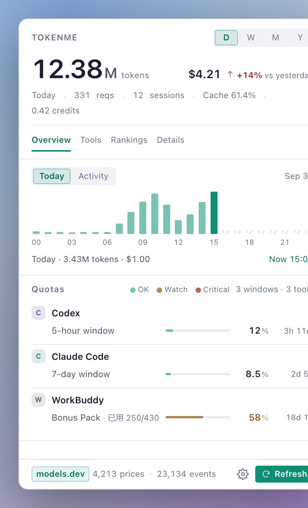
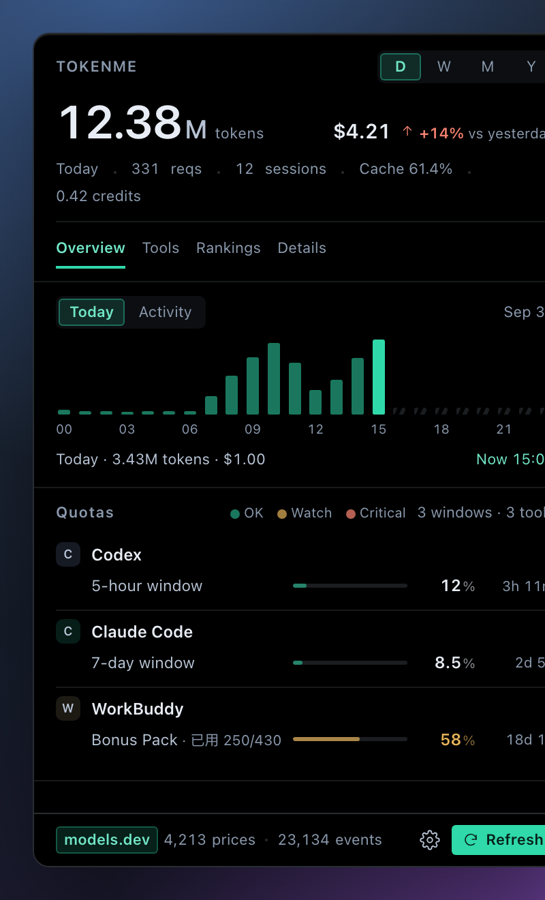
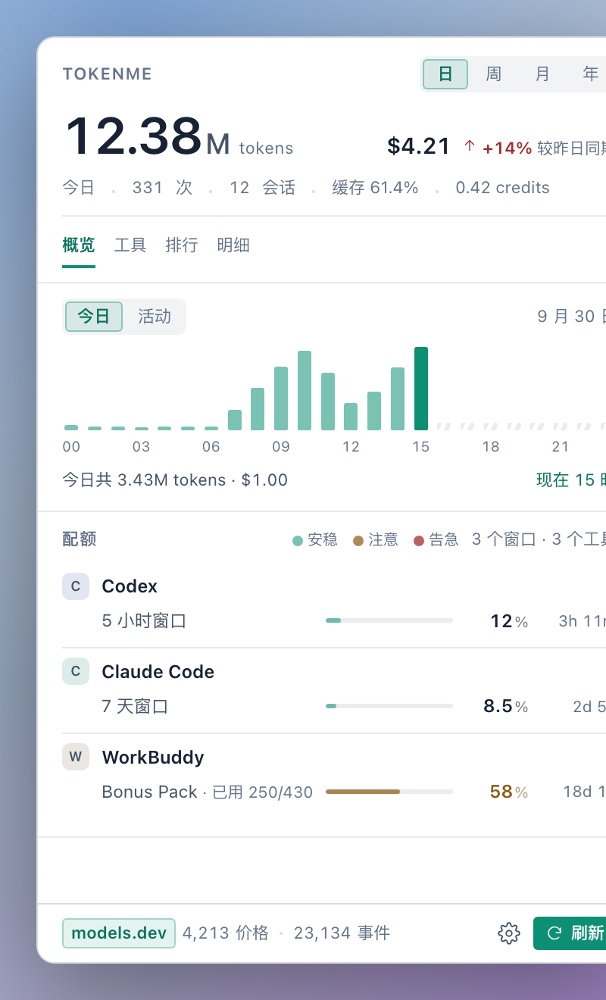
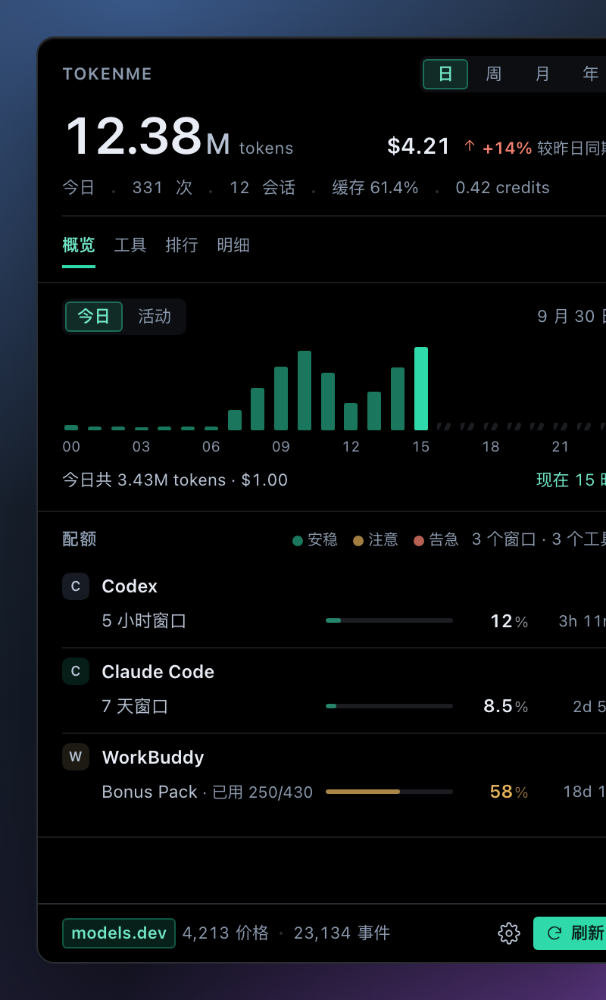
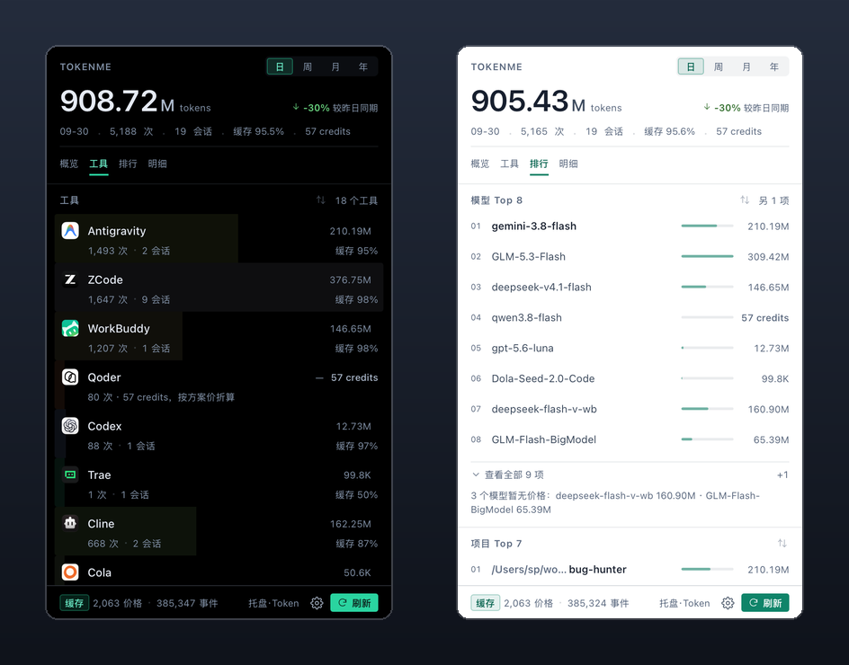

<p align="center">
  
</p>

<p align="center">
  <a href="https://github.com/sp/tokenme"></a>
  <a href="https://www.rust-lang.org/"></a>
  
  
</p>

<p align="center">
  <b>Cross-tool AI coding token, cost, and real-time quota monitor.</b>
  <br>
  Zero telemetry · No third-party proxy · Instant scanning
</p>

<p align="center">
  <b>English</b> | <a href="README_CN.md">简体中文</a>
</p>

## 💡 Why TokenMe?

When you develop with multiple AI coding tools (Claude Code, Codex, OpenCode, Cline, ZCode…), usage is a black box: *how much did today cost, how much of my 5-hour pool is left, how good is my cache hit rate?* TokenMe reads the tools' own logs and local databases into an instant SQLite index and answers all three in one dashboard — CLI and menu bar.

## 📸 Screenshots

<p align="center">
  <b>English UI</b><br>
  
  
</p>

<p align="center">
  <b>Chinese UI</b><br>
  
  
</p>

## ✨ Features

- 🔒 **Local index, read-only scanning**: Usage is indexed on your machine from the tools' own logs. No telemetry and no third-party proxies; live quota probes and the model price list are the only network calls.
- ⚡ **Instant Scanning**: High-performance Rust incremental index scans hundreds of thousands of events in seconds.
- 🎯 **20 Tools Supported**: Claude Code, Codex, OpenCode, Cline, ZCode, Qoder, Pi, Antigravity, WorkBuddy, AgnesCode, AtomCode, Crow5, Mimocode, Cola, DSH, Hermes, JoyCode, FunIDE, CatPaw, Trae.
- 📊 **Token & Cost Analytics**: Input, cache read, output and cost breakdown via [models.dev](https://models.dev).
- ⏱️ **Live Quota Probes**: Rolling 5-hour windows, weekly quotas, credit plans and reset countdowns.
- 🌐 **Bilingual UI**: UI language follows the system — English and Chinese, defaults to Chinese.

<p align="center">
  
</p>

## ⚡ Preview

```text
$ tokenme daily --days 3

┌────────────┬──────────┬──────────┬────────┬────────────┬────────┬────────┬─────────┬────────┐
│ Day        │ sessions │ requests │  input │ cache read │ output │  total │    cost │ cached │
├────────────┼──────────┼──────────┼────────┼────────────┼────────┼────────┼─────────┼────────┤
│ 2026-09-25 │      216 │   12,900 │  56.2M │      1.68B │   4.5M │  1.74B │  $99.15 │  96.8% │
│ 2026-09-26 │       45 │    4,592 │  30.5M │     704.9M │   1.8M │ 737.1M │  $54.53 │  95.9% │
│ 2026-09-27 │        6 │    2,534 │  25.1M │     377.1M │   1.1M │ 403.4M │  $46.49 │  93.8% │
├────────────┼──────────┼──────────┼────────┼────────────┼────────┼────────┼─────────┼────────┤
│ total      │      256 │   20,026 │ 111.8M │      2.76B │   7.4M │  2.88B │ $200.18 │  96.1% │
└────────────┴──────────┴──────────┴────────┴────────────┴────────┴────────┴─────────┴────────┘
```

## 🚀 Quick Start

**Download** the installer from [Releases](https://github.com/sp/tokenme/releases/latest) — a macOS menu-bar app (drag to Applications) and a Windows setup. Or build from source:

> **First launch on macOS**: the bundle is ad-hoc signed (no developer certificate), so Gatekeeper may block it. Besides right-click → Open, the direct way is clearing the quarantine flag and launching normally:
>
> ```bash
> sudo xattr -rd com.apple.quarantine /Applications/TokenMe.app
> ```

```bash
git clone https://github.com/sp/tokenme.git
cd tokenme
cargo install --path crates/usage-cli --bin tokenme   # the CLI
./scripts/build-macos.sh                              # the macOS panel
```

Then:

```bash
tokenme detect          # 1. discover local AI tools and logs
tokenme daily --days 7  # 2. tokens and cost for the past week
tokenme quota           # 3. live subscription quotas and reset timers
```

## 🛠️ Commands

| Command | What it does |
| :--- | :--- |
| `tokenme daily --days 30` | Daily throughput, cache rate & cost |
| `tokenme report --window week --group model` | One window, broken down, with deltas |
| `tokenme quota` | Live quotas and reset countdowns |
| `tokenme budget set zcode --monthly 50` | Spend caps for unlimited-plan tools |
| `tokenme pricing explain <model>` | Audit which price listing won |

## 🧩 Supported Host Agents & Live Quota

Quota bars come from each tool's own API or local credentials (read-only probes — your login state is never refreshed or replaced). When a host app quits, probing for that tool pauses automatically and the last numbers stay on screen; it resumes on relaunch. The "pause quota on host exit" toggle in Settings controls this.

Every host below ships as a built-in adapter — 20 tools, indexed from the logs and local databases each one already writes:

| Host agent | Live quota | Compatibility test | Platform verification |
| :--- | :--- | :--- | :--- |
|  **Claude Code** | 5-hour / weekly windows — official backend | ✅ | macOS ✅ · Windows ⏳ |
|  **Codex** | ChatGPT rate windows — official backend | ✅ | macOS ✅ · Windows ✅ |
|  **OpenCode** | Go subscription, three dollar windows | ✅ | macOS ✅ · Windows ⏳ |
|  **Pi** | — | ✅ | macOS ✅ · Windows ⏳ |
|  **Cline** | account window limits — Cline account API | ✅ | macOS ✅ · Windows ⏳ |
|  **ZCode** | 5-hour/cycle windows + session budgets — the IDE's own quota API + local cookie decryption | ✅ | macOS ✅ · Windows ✅ |
|  **Qoder** | subscription windows — vendor usage API, local encrypted snapshot fallback | ✅ | macOS ✅ · Windows ⏳ |
|  **Antigravity** | self-computed quota — runs the CLI's `/usage` | ✅ | macOS ✅ · Windows ⏳ |
|  **AgnesCode** | membership points — needs a one-time token (see below) | ✅ | macOS ✅ · Windows ✅ |
|  **AtomCode** | CodingPlan quota — local daemon | ✅ | macOS ✅ · Windows ⏳ |
|  **WorkBuddy** | member credits — the desktop app's own billing API / local broker | ✅ | macOS ✅ · Windows ✅ |
|  **Hermes** | — | ✅ | macOS ✅ · Windows ⏳ |
|  **FunIDE** | GLM-plan points — cloud points API | ✅ | macOS ✅ · Windows ⏳ |
|  **CatPaw** | points balance — points portal API | ✅ | macOS ✅ · Windows ⏳ |
|  **DSH** | DeepSeek account balance — official user/balance + desktop credentials file | ✅ | macOS ✅ · Windows ✅ |
|  **Crow5** | — | ✅ | macOS ✅ · Windows ⏳ |
| **Mimocode** | — | ✅ | macOS ✅ · Windows ⏳ |
|  **Cola** | plan quota — vendor billing API, local credential decryption | ✅ | macOS ✅ · Windows ⏳ |
|  **JoyCode** | IDE points — reads the IDE's own login state | ✅ | macOS ✅ · Windows ⏳ |
|  **Trae** | subscription quota — vendor v1 API, local credential decryption | ✅ | macOS ✅ · Windows ⏳ |

> **Compatibility test** — every adapter carries a fixture test suite that CI runs on each commit, and each integration was verified against a real machine's data before landing.
>
> **Platform verification** — updated as each host is proven on real hardware. ⏳ means the paths are implemented for that platform but not yet verified there; flip the mark when a verification run passes.
>
> Quota-only sources: **Copilot** (premium-request allowance, official backend) is probed without indexing its usage; the **Gemini CLI** probe is deliberately dark — its on-disk OAuth token expires and refreshing credentials is out of scope for a read-only probe.

> **AgnesCode token**: the login token lives only in the app's memory and cannot be read silently. Sign in at agnescode.agnes-ai.cn, copy the `access_token` from an authenticated request into `~/.config/tokenme/agnes.token` (or set `AGNES_TOKEN`).

Full reference: **[docs/COMMANDS.md](docs/COMMANDS.md)** · Scenarios & panel guide: **[docs/USER_GUIDE.md](docs/USER_GUIDE.md)** · Architecture: **[docs/ARCHITECTURE.md](docs/ARCHITECTURE.md)** · Adapter reverse-engineering notes: [docs/ADAPTERS_DESIGN.md](docs/ADAPTERS_DESIGN.md)

## 🔒 Privacy & Data

Counts only, never content — your code and prompts are never indexed, just per-request token counts, model names and project paths. Scanning is read-only; no telemetry, no third-party proxies. The index lives under the OS data directory (`~/Library/Application Support/tokenme/` on macOS); per-tool log paths are in the [user guide](docs/USER_GUIDE.md).

## 💬 Community

| | |
| :--- | :--- |
| Issues | [GitHub Issues](https://github.com/sp/tokenme/issues) |
| WeChat user group |  |
| Email | Panel → Settings → Contact (address in `apps/tokenme-bar/src/lib/about.ts`) |

## 📄 License

Licensed under [MIT](LICENSE).
