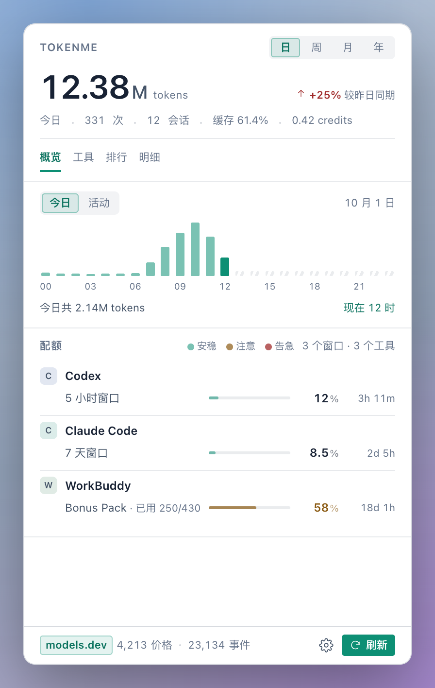
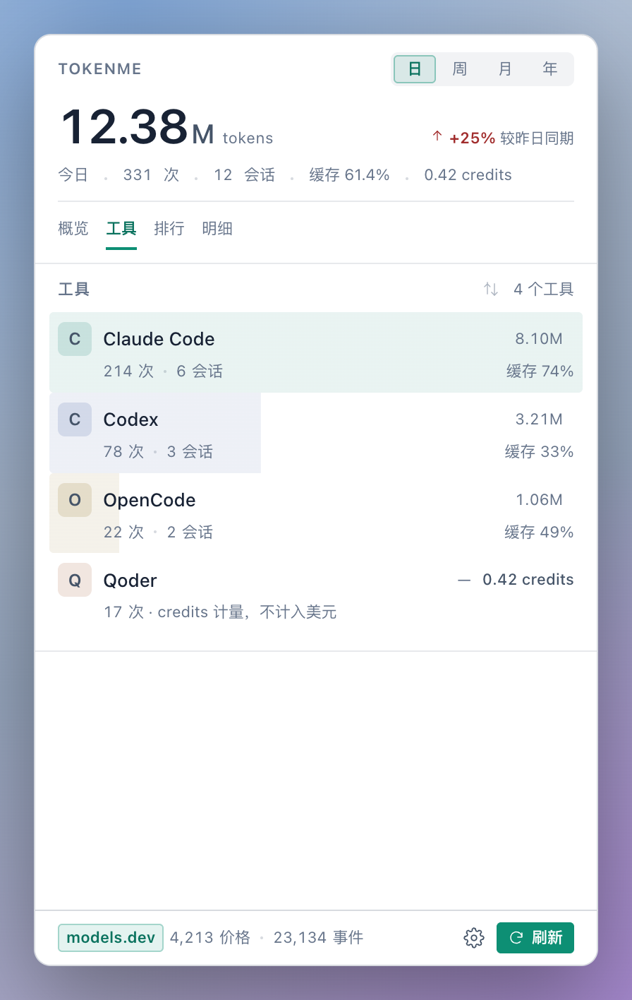
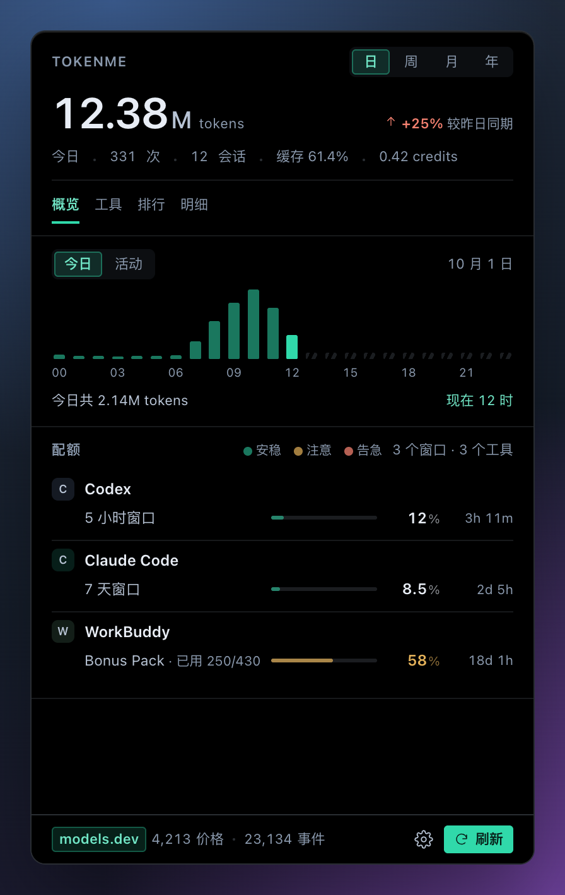
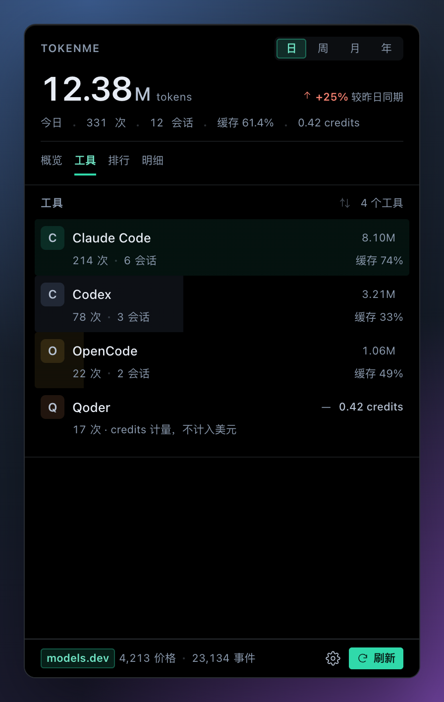

<p align="center">
  
</p>

<p align="center">
  <a href="https://github.com/Bencibr/tokenme"></a>
  <a href="https://www.rust-lang.org/"></a>
  
  
</p>

<p align="center">
  <b>一份菜单栏看板，看清每个 AI 编程工具的 token 用量、花费与剩余额度——不用再挨个翻各家的控制台。</b>
</p>

<p align="center">
  <a href="README.md">English</a> | <b>简体中文</b>
</p>

## 这是什么

TokenMe 是一个统计 AI 编程工具 token 用量、费用与订阅额度的菜单栏应用：macOS 与 Windows 有原生安装包，Linux 是一等的静态采集端，外加命令行工具。它回答三个平时没地方看的问题：

- 今天用了多少 token、折合多少钱？
- 各家订阅的额度还剩多少、什么时候重置？
- 这个月每个工具各占了多少开销，缓存到底省了多少？

这些数字平时散在各家自己的控制台和本地日志里，口径互不相通。TokenMe 直接读取这些工具写在磁盘上的日志和数据库，在本机汇成一份索引。

## 解决什么问题

同时用 Claude Code、Codex、ZCode 和其他 AI 编程工具时，这些场景大概不陌生：

- 想知道今天花了多少钱，得挨个打开各家的控制台，口径还对不上；
- 5 小时滚动窗口快用完了才发现，正赶上活儿最紧的时候；
- 点数、credits、美元窗口——每种订阅一个看板，各看各的；
- 月底想复盘：哪个工具是大头、缓存命中率省了多少钱，只能翻日志自己算。

TokenMe 把这些收进同一个面板，菜单栏随时点开。

## 运行截图

<p align="center">
  
  
  
  
</p>

## 面板里有什么

菜单栏点开后分四页，一层层往下钻：

- **概览**——当天的 token、费用与缓存命中率，按小时分布的用量柱状图，下面是各家配额条：剩余比例和重置倒计时；窗口跨过 80% 或耗尽时弹一条原生通知——提醒档位与「问哪几家」都归设置管；
- **工具**——每个工具的请求数、会话数、token 量与缓存率，一行一个，用量占比就画在行底色里；
- **排行**——按会话排名，一眼找出最贵的那几个；
- **明细**——单次请求级的记录，可以按模型、项目筛选。

界面语言跟随系统，中英双语。费用是折算出来的：token 计数乘以 [models.dev](https://models.dev) 的模型单价——和官方扣款记录未必分毫不差，但足够回答钱花在哪、花得值不值。几十万条事件的索引在本机秒级建好，之后每次增量扫描只需几十毫秒。

## 命令行

不开面板时，CLI 读的是同一份索引：

```text
$ tokenme daily --days 3

┌────────────┬──────────┬──────────┬────────┬────────────┬────────┬────────┬─────────┬────────┐
│ Day        │ sessions │ requests │  input │ cache read │ output │  total │    cost │ cached │
├────────────┼──────────┼──────────┼────────┼────────────┼────────┼────────┼─────────┼────────┤
│ 2026-09-25 │      216 │   12,900 │  56.2M │      1.68B │   4.5M │  1.74B │  $99.15 │  96.8% │
│ 2026-09-26 │       45 │    4,592 │  30.5M │      704.9M │   1.8M │ 737.1M │  $54.53 │  95.9% │
│ 2026-09-27 │        6 │    2,534 │  25.1M │      377.1M │   1.1M │ 403.4M │  $46.49 │  93.8% │
├────────────┼──────────┼──────────┼────────┼────────────┼────────┼────────┼─────────┼────────┤
│ total      │      256 │   20,026 │ 111.8M │      2.76B │   7.4M │  2.88B │ $200.18 │  96.1% │
└────────────┴──────────┴──────────┴────────┴────────────┴────────┴────────┴─────────┴────────┘
```

## 安装

**Homebrew（macOS）**——tap 一次，之后用短名：

```bash
brew tap Bencibr/tokenme https://github.com/Bencibr/homebrew-tokenme
brew trust bencibr/tokenme        # 一次即可——brew 6 对第三方 cask 有信任确认
brew install --cask tokenme       # 菜单栏面板
brew install tokenme-cli          # CLI
```

tap 随每次发布自动更新，`brew upgrade` 即可升级；cask 安装不带隔离标记，Gatekeeper 不会拦。

**安装包**：到 [Releases](https://github.com/Bencibr/tokenme/releases/latest) 下载，里面有 macOS 菜单栏应用（拖入 Applications）、Windows 安装程序，以及 Linux 静态采集端压缩包（`x86_64` / `aarch64`，包内已附 `install-linux.sh`）。

**Windows 安装**：安装器支持“所有用户”模式。共享电脑上请选择“所有用户”，升级时也保持同一模式，这样会原地替换机器级安装，并对所有 Windows 账户生效。

> **macOS 首次打开**（仅手动装 DMG 时）：安装包是 ad-hoc 签名（没有开发者证书），Gatekeeper 可能拦一下——右键打开即可，或者清掉隔离标记后正常启动：
>
> ```bash
> sudo xattr -rd com.apple.quarantine /Applications/TokenMe.app
> ```

想从源码构建：

```bash
git clone https://github.com/Bencibr/tokenme.git
cd tokenme
cargo install --path crates/usage-cli --bin tokenme   # CLI
./scripts/build-macos.sh                              # macOS 面板
```

装好先跑一次探测，再看最近一周的账：

```bash
tokenme detect          # 自动探测本机装了哪些工具、日志在哪
tokenme daily --days 7  # 最近一周的每日消耗与账单
tokenme quota           # 各家订阅的实时额度与重置倒计时
```

## Linux —— 无头采集端

菜单栏面板只有 macOS 和 Windows。而**真正干活的机器往往是 Linux**——你 ssh 上去的服务器、跑 agent 的容器、不出图形的构建机——所以 Linux 不是"能用命令行"的附庸，而是一等采集端：一个完全静态的二进制（musl，`x86_64` 与 `aarch64` 两种，不用对齐 glibc 版本，机器上也不需要装 Rust 或 Python），加一条命令就能把数据报回家。

```bash
tar xzf tokenme-cli-*-linux-musl.tar.gz
cd tokenme-cli-*-linux-musl
./install-linux.sh --every 15 --push you@display-host
```

这条命令把 `tokenme` 装进 `~/.local/bin`（`~/.profile` 里缺 PATH 时会补上），并装一个 **systemd `--user` 定时器**：每 15 分钟执行一次 `tokenme export --days 30`，把 bundle 写进 `~/tokenme-sync`，再 scp 给展示机——面板下一轮自动合并，并把这台机器当成独立来源按名字显示。如果机器上没有可用的 user manager（容器、裸 ssh 会话），安装器**退化成 cron 任务跑同一个脚本**；`--uninstall` 两种都会清理，且保留你的数据。无头机器上安装器还会打开 lingering（不行时就打印出那行要你自己跑的 `loginctl enable-linger $USER`），让定时器在无人登录时照样触发。首次想补齐历史就单独跑一次 `--days 400`（整个保留窗口），`--prefix <dir>` 可以换安装目录。

在终端里直接用它，不接显示器也能拿到同一套数字：

```bash
tokenme detect          # 这台机器装了哪些工具、各自日志在哪
tokenme daily --days 7  # 最近一周用量与花费
tokenme quota           # 实时额度与重置倒计时
tokenme export          # 手动产出一个 bundle 到 ~/tokenme-sync
```

也可以完全不用定时器，自己搬 `~/tokenme-sync`——Syncthing、共享挂载、每晚 rsync 都行。传输通道由你决定：tokenme 不监听端口、除这个定时器外不驻留守护进程、也不持有任何账号。面板底栏的「服务器」入口还能把 SSH 这半边代办掉：探测主机、固定指纹、投放采集器并按周期拉取合并。详见[用户指南](docs/USER_GUIDE.md) §4。

## 常用命令

| 命令 | 说明 |
| :--- | :--- |
| `tokenme daily --days 30` | 按天汇总吞吐、缓存率与费用 |
| `tokenme report --window week --group model` | 单窗口多维拆分与环比 |
| `tokenme quota` | 实时配额与重置倒计时 |
| `tokenme budget set zcode --monthly 50` | 为无限额工具设定成本上限 |
| `tokenme export` / `tokenme import` | 把本机一段窗口导出给另一台机器合并——纯文件、幂等、无账号 |
| `tokenme pricing explain <model>` | 审计定价来源 |

## 支持的工具与实时配额

配额条来自各工具自己的接口或本地凭据——探测只读，绝不代替你的登录。有三处是有意之外的例外，因为这些工具在磁盘上存的是短时效访问令牌，不续期额度条就会长期空白：MiniMax Code（约 1 小时）、Kimi Code（厂商自己的 15 分钟令牌）以及 Cline 的 gateway 令牌。三者都只拿同一份文件里的 refresh token 去换，并把轮换后的新对子按该工具自己的格式原子性地写回——没有落盘的轮换等于已经被消耗掉的轮换，应用下一次自己刷新时就会发现登录已经死了。换取失败则什么都不改。其余所有探测只读凭据、绝不写回。宿主应用退出后自动暂停对应工具的探测、保留最后数值，重新启动即恢复——设置里的"退出后暂停配额"开关可控制这一行为。

以下工具全部内置适配器——共 24 款，直接从各工具自己落盘的日志与数据库建立索引：

| 工具 | 实时配额 | 兼容性测试 | 平台验证 |
| :--- | :--- | :--- | :--- |
|  **Claude Code** | 5 小时/周期窗口 — 官方后端 | ✅ | macOS ✅ · Windows ⏳ |
|  **Codex** | ChatGPT 速率窗口 — 官方后端 | ✅ | macOS ✅ · Windows ✅ |
|  **OpenCode** | Go 订阅三窗口（美元额度） | ✅ | macOS ✅ · Windows ⏳ |
|  **Pi** | — | ✅ | macOS ✅ · Windows ⏳ |
|  **Cline** | 账号窗口限额 — Cline 账号 API | ✅ | macOS ✅ · Windows ✅ |
|  **ZCode** | 5 小时/周期窗口 + 会话预算 — IDE 同款配额接口 + cookie 本地解密 | ✅ | macOS ✅ · Windows ✅ |
|  **Qoder** | 订阅额度 — 官方用量接口，本地加密快照兜底；支持每日签到状态 | ✅ | macOS ✅ · Windows ⏳ |
|  **Antigravity** | 自算配额 — 调用其 CLI 的 `/usage` | ✅ | macOS ✅ · Windows ⏳ |
|  **AgnesCode** | 会员点数 — 需注入一次令牌（见下） | ✅ | macOS ✅ · Windows ✅ |
|  **AtomCode** | CodingPlan 配额 — 本地守护进程 | ✅ | macOS ✅ · Windows ⏳ |
|  **WorkBuddy** | 会员点数 — 桌面 app 同款计费接口 / 本地 broker | ✅ | macOS ✅ · Windows ✅ |
|  **CodeBuddy** | Craft 积分 — plans-usage 计费接口；用量取自 IDE history | ✅ | Windows ✅ |
|  **Hermes** | — | ✅ | macOS ✅ · Windows ⏳ |
|  **FunIDE** | GLM 套餐点数 — 云端点数接口 | ✅ | macOS ✅ · Windows ⏳ |
|  **CatPaw** | 积分余额 — 积分门户接口 | ✅ | macOS ✅ · Windows ⏳ |
|  **DSH** | DeepSeek 账户余额 — 官方 user/balance + 桌面端凭据文件 | ✅ | macOS ✅ · Windows ✅ |
|  **Crow5** | — | ✅ | macOS ✅ · Windows ⏳ |
| **Mimocode** | — | ✅ | macOS ✅ · Windows ⏳ |
|  **Cola** | 套餐配额 — 官方 billing 接口，本地凭据解密 | ✅ | macOS ✅ · Windows ⏳ |
|  **JoyCode** | IDE 点数 — 读取 IDE 自身登录态 | ✅ | macOS ✅ · Windows ⏳ |
|  **Trae** | 订阅配额 — 官方 v1 接口，本地凭据解密；支持每日签到 | ✅ | macOS ✅ · Windows ⏳ |
|  **Trae CN** | 订阅配额 — CN 独立接口与凭据存储，按积分包拆分额度并支持每日签到 | ✅ | macOS ✅ · Windows ⏳ |
|  **Kimi Code** | 套餐额度 — 5 小时 / 每周 / 每月，走官方 `/usages`；用量读 CLI 或桌面端内嵌 runtime 的日志；访问令牌过期时按官方刷新契约就地续期 | ✅ | macOS ✅ · Windows ✅ |
|  **MiniMax Code** | 套餐额度 — 5 小时 / 每周 — 外加积分余额（购买与签到两种钱包）；约 1 小时过期的访问令牌由 tokenme 用应用自己的刷新令牌原地续期 | ✅ | macOS ✅ · Windows ✅ |

> **兼容性测试**：每款适配器都带夹具测试套件，CI 每次提交全量运行；每项接入落地前都用真实机器的数据验证过。
>
> **平台验证**：随实机验证进度更新。⏳ 表示该平台的路径已实现、但尚未在实机上跑通；验证通过后更新标记即可。
>
> 仅配额的来源：**Copilot**（高级请求额度，官方后端）只探测配额、不索引用量；**Gemini CLI** 的探测刻意关闭——实测其落盘 OAuth 令牌已过期，要续期就得用 Gemini CLI 自带包里的 client id/secret 去提交表单，而磁盘上也找不到该接口要的 project id（`crates/usage-quota/src/providers/gemini.rs`）。

> **AgnesCode 令牌注入**：其登录令牌只存在于应用内存，无法静默读取。登录 agnescode.agnes-ai.cn 后从请求头取 `access_token`，写入 tokenme 系统配置目录下的 `agnes.token`（macOS 为 `~/Library/Application Support/tokenme/agnes.token`，Linux 为 `~/.config/tokenme/agnes.token`，Windows 为 `%APPDATA%\tokenme\agnes.token`），或设置 `AGNES_TOKEN` 即可启用。

完整参考：**[docs/COMMANDS.md](docs/COMMANDS.md)** · 场景指南：**[docs/USER_GUIDE.md](docs/USER_GUIDE.md)** · 架构总览：**[docs/ARCHITECTURE.md](docs/ARCHITECTURE.md)**

## 0.1.6 更新内容

- **新增**：桌面宠物皮肤（水滴 / 动态小猫 / 古风萌女孩 / 古风萌男孩 / 现代风美少女 / 夏日长腿美女——眨眼、瞳孔跟随、贴边姿态，悬停显示 token 徽标）；夏日皮肤保留成年人物的修长比例，显示尺寸与眼睛锚点由 JSON 皮肤包配置；宠物注册表新增按需加载的 GLB/VRM 3D 模型皮肤，支持 JSON 相机、头部跟踪配置，并保留 2D 回退；小猫顶部姿态重做为紧凑的向下探看；Trae、Trae CN、Qoder 每日签到，厂商确认成功才算完成；Trae CN 独立适配器与积分包窗口；设置拆分为通用 / 提醒 / 高级 / 关于四页，支持逐工具配额开关与自动签到。
- **验证**：WorkBuddy、Cline 通过 Windows 实机验证。
- **修复**：Windows 托盘点击、面板显示/隐藏、无边框窗口与悬浮气泡的生命周期，修复面板不可见与残留表面。

## 数据与隐私

只索引计数，不碰内容——你的代码和 Prompt 不会被存储，入库的只有每次请求的 token 计数、模型名与项目路径。扫描全程只读，无遥测、无第三方代理。索引库位于系统数据目录（macOS 为 `~/Library/Application Support/tokenme/`）；各工具日志路径见[用户指南](docs/USER_GUIDE.md)。

多机之间也可以同步各自的索引——基于文件的 `tokenme export` / `tokenme import`，走你自己的通道（ssh/scp、Syncthing），无账号、无云端。每次合并前先过 sha256 与清单校验、单事务要么全落要么全不动；unix 下 bundle 一律 `0600`。面板底栏的服务器按钮也能把这条通道一键拉起：SSH 向导用一次密码连接（或指定私钥），装上专用密钥、投放静态采集器，之后按周期自动拉取合并；密码不落盘。只要有一台以上机器在报数，顶部的下拉就能把每一项数字、排行和会话列表按 **全部机器**、**本机** 或按名字选任意一台远程机器 折叠——同一份索引重新汇总，不重新索引，另有每台机器最近一次合并的徽标。详见[用户指南](docs/USER_GUIDE.md) §4。

## 社区

| | |
| :--- | :--- |
| 问题反馈 | [GitHub Issues](https://github.com/Bencibr/tokenme/issues) |
| 微信交流群 |  |
| 邮箱 | 面板「设置 → 联系我们」直达（地址在 `apps/tokenme-bar/src/lib/about.ts`） |

## 许可证

基于 [MIT](LICENSE) 协议开源。
