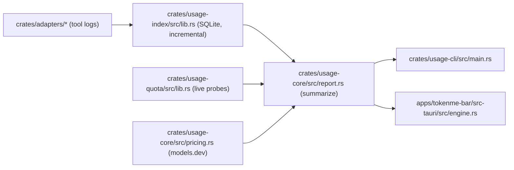

# TokenMe Architecture

> Version: 0.1.0 · Updated: 2026-09-29 · Audience: contributors · Deep adapter notes: [docs/internal/ADAPTERS_DESIGN.md](internal/ADAPTERS_DESIGN.md)

## One-paragraph summary

Every supported AI tool writes its own local logs; TokenMe never talks to a vendor to *count* usage. Per-tool adapters normalise those logs into one `UsageEvent` shape, an incremental SQLite index ingests them (byte cursors, dedupe keys, retention), `usage-core` turns events into money and windows, and two frontends — the CLI and the macOS menu-bar panel — render the same numbers from the same index.

## Crate map

| Crate | Responsibility |
| :--- | :--- |
| `crates/usage-core` | Shared contract: `UsageEvent`/`TokenCounts`, pricing (models.dev precedence), report aggregation, budgets |
| `crates/usage-index` | SQLite incremental index: file cursors, dedupe, ingest lease, retention, watcher |
| `crates/usage-quota` | Live vendor quota probes (one file per provider), per-vendor TTL cache |
| `crates/adapters/<tool>` | One crate per tool (16), each with its own parser + tests against fixtures |
| `crates/adapters/all` | Registry: `TOOL_IDS`, `detect_all`, `builtin_adapters` |
| `crates/usage-cli` | The `tokenme` CLI |
| `apps/tokenme-bar` | Tauri 2 menu-bar panel (frontend `src/`, Rust `src-tauri/`) |

## Data flow

The engine thread in the panel owns the index; the webview never touches it directly — the engine publishes a serialised `Report` over a Tauri event after every pass.

That loop is supervised: a panic or an unexpected return is logged to `panel.log` with its reason and restarted with capped backoff, because a menu-bar app that stops publishing keeps rendering numbers and gives no other sign. The panel itself states the age — a report older than five cadences shows "Updates stopped" in the header.

## Key invariants

- **Incremental, never re-read**: adapters return a byte/row cursor; the index resumes exactly where the last pass stopped. A shrunken file purges its own stale rows first.
- **Idempotent ingestion**: events carry stable dedupe keys; replaying a log never double-counts.
- **One index, many readers**: an ingest lease (claim with TTL, steal with `--force`) keeps concurrent passes serialised.
- **Money lives in usage-core**: CLI and panel can never disagree about a number.
- **Retention window** bounds the index; `--prune` drops older events.

## Testing conventions

Every adapter ships fixture-driven tests (fixtures are anonymised — no real session data), plus a parity test asserting the adapter's numbers match an independent SQL recomputation. Index tests cover cold ingest, resume, parallel ingest parity and corruption quarantine.
