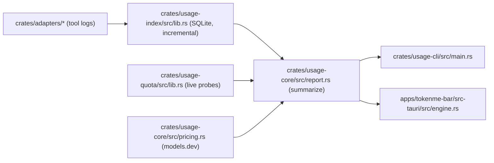

# TokenMe Architecture

> Version: 0.1.5 · Updated: 2026-10-07 · Audience: contributors · Deep adapter notes: [docs/internal/ADAPTERS_DESIGN.md](internal/ADAPTERS_DESIGN.md)

## One-paragraph summary

Every supported AI tool writes its own local logs; TokenMe never talks to a vendor to *count* usage. Per-tool adapters normalise those logs into one `UsageEvent` shape, an incremental SQLite index ingests them (byte cursors, dedupe keys, retention), `usage-core` turns events into money and windows, and two frontends — the CLI (macOS, Linux, Windows) and the menu-bar panel (macOS and Windows) — render the same numbers from the same index.

## Crate map

| Crate | Responsibility |
| :--- | :--- |
| `crates/usage-core` | Shared contract: `UsageEvent`/`TokenCounts`, pricing (models.dev precedence), report aggregation, budgets |
| `crates/usage-index` | SQLite incremental index: file cursors, dedupe, ingest lease, retention, watcher |
| `crates/usage-quota` | Live vendor quota probes (one file per provider), one shared 5-minute TTL with one cache file per tool |
| `crates/adapters/<tool>` | One crate per tool family (19), each with its own parser + tests against fixtures; three sibling products ride an existing crate's parser (crow5 and mimocode in `opencode`, cola in `pi`) |
| `crates/adapters/all` | Registry: `TOOL_IDS`, `detect_all`, `builtin_adapters` |
| `crates/usage-cli` | The `tokenme` CLI |
| `apps/tokenme-bar` | Tauri 2 menu-bar panel (frontend `src/`, Rust `src-tauri/`) |

## Data flow

The engine thread in the panel owns the index; the webview never touches it directly — the engine publishes a serialised `Report` over a Tauri event after every pass.

That loop is supervised: a panic or an unexpected return is logged to `panel.log` with its reason and restarted with capped backoff, because a menu-bar app that stops publishing keeps rendering numbers and gives no other sign. The panel itself states the age — a report older than five cadences shows "Updates stopped" in the header.

Cold start is ordered so the panel never waits on work it does not need. The engine opens the index (schema only), publishes the last-known report from disk before scanning anything, and only then runs `Index::verify_integrity` — the `PRAGMA quick_check` that reads every page (0.4 s warm, 3.6 s cold on a 170 MB index) sits *after* the first publish and *before* the first write, so a damaged image still quarantines and rebuilds on every launch without ever standing in front of the screen. The CLI keeps the check immediately after open: it is a diagnostic entry point, not a render path. On the page side, `index.html` carries a pre-paint boot shell (the same markup as the app's loading card, its appearance mirrored from the last applied theme) because WebKit composites an unpainted view as a flat sheet — and the shell cannot be replaced by "wait to show the window until the page reports": measured here, a window that is never ordered front loads its page in 3.5–4.3 s instead of 1.1–1.6 s, so the wait would be caused by the waiting. `panel.log` prints the budget (`boot: … detect/pricing/index open/count/sources/report`, and `the page reported content N ms after launch`) so a slow open is attributed rather than argued about.

## Key invariants

- **Incremental, never re-read**: adapters return a byte/row cursor; the index resumes exactly where the last pass stopped. A shrunken file purges its own stale rows first.
- **Idempotent ingestion**: events carry stable dedupe keys; replaying a log never double-counts.
- **One index, many readers**: an ingest lease (claim with TTL, steal with `--force`) keeps concurrent passes serialised.
- **Money lives in usage-core**: CLI and panel can never disagree about a number.
- **Retention window** bounds the index; `--prune` drops older events.

## Testing conventions

Every adapter ships fixture-driven tests (fixtures are anonymised — no real session data), plus a parity test asserting the adapter's numbers match an independent SQL recomputation. Index tests cover cold ingest, resume, parallel ingest parity, and the corruption path: `Index::open` is the cheap handle, `Index::verify_integrity` is the whole-file guard that sets a damaged image aside (with its `-wal` and `-shm`, so a rebuild cannot inherit them) and hands back an empty one for the next ingest to refill.
